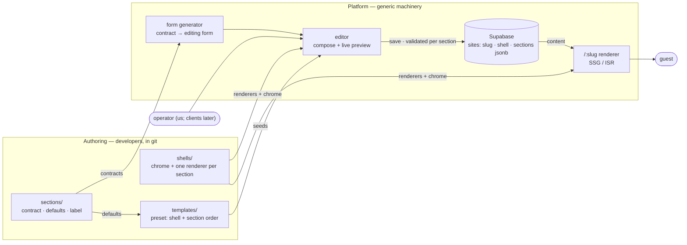

# Nuansa — Spec v3: sections + shells

> Status: implemented for the invitation category.
> Decided (2026-07-08): **Supabase**; concierge editing first (we compose, the
> client never sees a builder); display-only v1 (RSVP/guestbook are widgets that
> wait for persistence); public portfolio repo.
> Decided (2026-07-09, revising v2): the editor **may reorder, toggle, add and
> remove sections**, and **section renderers live in the shell**.

## The idea in one paragraph

A large class of websites exists only to *display information a client hands
you*: online invitations, linktree-style profiles, restaurant menus, event
guides. Nuansa serves all of them from one mechanism. Developers author two
things — **sections** (content blocks with a contract, no styling) and
**shells** (a visual identity plus one renderer per section it supports). A
**template** is just a preset: a shell and a default section order. The
platform generates each section's editing form from its contract, lets an
operator compose the page, stores the result, and serves it at a public URL.
The platform never knows what a "wedding" or a "menu" is.

## The system at a glance



Read off the diagram: the shell is the *only* box that knows what anything
looks like, and it appears twice — the editor preview and the published page
use the same renderers, so preview is production.

## Why this shape

The first architecture had a section registry with **one global renderer set**.
Every template was therefore the same page reskinned, and the composability it
bought served nobody. We deleted it. v2 swung the other way: a template was a
hand-written page with a fixed contract — great design freedom, but nothing
could be reordered or reused without editing code.

v3 keeps both properties by moving the renderers:

- **Sections own content, not looks.** A contract, defaults, a label, an icon.
- **Shells own looks.** Chrome *and* a renderer per section. Two shells present
  the same section in genuinely different designs — that's the moat.
- **Compatibility needs no metadata.** A shell can render exactly the sections
  it wrote a renderer for. A vertical-only section (gallery) is simply one that
  no paged shell renders; the add-section list is derived from the renderer map.
- **Sections are self-contained.** Countdown carries its own target date rather
  than reading the event section, so reordering or deleting can never break it.

The price, paid knowingly: because the section *set* is dynamic, content is
`Array<{ key, type, visible, content }>` — a discriminated union, validated
per section. Static typing survives where it matters (each renderer types its
`content` from that section's own contract) and goes loose only at the array.

## Adding a new kind of microsite

Nothing enumerates product types. A new category is a new **shell** plus
whatever **sections** it needs — no platform change. The platform only grows
along two axes, and only on real demand:

1. **A new field type** — a control the form generator lacks (e.g. rich text).
2. **A new widget** — an interactive capability (RSVP, guestbook, order form).

Categories are free; capabilities are the unit of platform work.

**Scope boundary:** Nuansa displays someone's information and maybe collects a
small response. An idea needing accounts, payments, or multi-step app flows is
an app wearing a microsite costume — build it separately.

## Vocabulary

| Term | Meaning |
| --- | --- |
| **Section** | A content block: contract + defaults + label + icon. No markup. `sections/`. |
| **Shell** | A visual identity: chrome + one renderer per supported section. `shells/`. |
| **Template** | A preset: shell id + default section order. `templates/`. |
| **Site** | One client's instance: shell + ordered section instances + slug. |
| **Operator** | Whoever composes — us first, clients later. |
| **Widget** (later) | A platform-provided interactive component (RSVP, guestbook). |

## What you author

**A section** (`sections/<id>.ts`, one file each, listed in `sections/index.ts`)
declares only what's editable:

```ts
export const countdown = defineSection({
  id: 'countdown',
  label: 'Hitung Mundur',
  Icon: Hourglass,
  contract: {
    title: f.text('Judul'),
    targetDate: f.date('Tanggal acara', { required: true }),
  },
  defaultContent: { title: 'Menghitung Hari', targetDate: '2026-11-13' },
})
```

**A shell** (`shells/<id>/`) brings the design and claims its sections:

```ts
export const kupuShell = defineShell({
  id: 'kupu',
  name: 'Kupu — bernavigasi per bagian',
  Chrome: KupuChrome,          // frame, ornament, bottom tab bar, music
  renderers: { cover: Cover, quotes: Quotes, /* … no `gallery` */ },
})
```

**Shell rules:**

1. Render purely from `content` — no fetching, no environment reads. This makes
   preview = production and SSG trivial. (A clock is behaviour, not a data
   read; see the countdown.)
2. Every renderer must tolerate **partial** content — the editor preview feeds
   it unvalidated draft values as the operator types. This is what lets the
   preview stay a dumb pass-through instead of holding a last-valid snapshot.
3. Never assume a section's neighbours, or that a section appears at all —
   including the case where the operator has hidden *every* section.
4. Meet the house accessibility bar (landmarks, contrast, reduced motion,
   44px targets) — enforced by review.

Everything else — fonts, colours, layout, ornament, nav model — is code inside
the shell. No canvas config, no platform theming.

## Reuse: what's shared, what isn't

Only **behaviour** is shared, via real imports from `lib/`: `useCountdown` (the
clock), `splitDate`, `MusicButton`. Logic-heavy, style-light, safe.

Layering, enforced by imports: `lib/fields.ts`, `lib/sections.ts` and
`lib/shells.ts` are generic and must never import the section library.
`lib/site.ts` is the single composition module allowed to know both — it joins a
shell to the sections it can render, and validates a whole site.

**Visuals are never shared.** Two shells rendering `cover` share zero markup —
that duplication *is* the product. A shared visual component library would
recouple every design and collapse them back into one reskinned page.

Extraction discipline: behaviour moves to `lib/` the second time it's written,
never in anticipation.

The honest ceiling: when each design needs bespoke *art*, the design reuses but
the assets don't. (Both current shells sidestep this — Kupu's ornament is
inline SVG, Alur is pure typography.)

## The field vocabulary

The one piece of genuinely generic machinery. Each helper wraps a Zod schema
and carries a label + control type; the form generator walks a contract and
renders it, recursing through `group` and `list`.

| Helper | Editor control | Notes |
| --- | --- | --- |
| `f.text` | single-line input | optional `required`, `maxLength` |
| `f.textarea` | multi-line input | |
| `f.image` | URL input (v1) | becomes an upload control when Supabase Storage lands |
| `f.date` | native date input | |
| `f.select` | dropdown | fixed options declared in the contract |
| `f.toggle` | switch | |
| `f.group` | fieldset | named cluster of fields |
| `f.list` | repeatable group | `min`/`max` enforced — "max 30 menu items" lives here |

Not in v1: rich text, colour pickers, file upload, custom controls. The
vocabulary grows only from real demand.

One Zod schema enforces the contract at every boundary: TypeScript types for a
renderer's props (`ContentOf`), the editor form (zodResolver, inline errors),
the server on save, and render-time parse.

## What the platform provides

1. **Template index** (`/`) — the presets. A real gallery with live previews is
   still to come.
2. **Editor** (`/editor/[template]`) — the generated form per section plus
   compose controls (reorder, toggle, add, remove), beside a live preview
   rendering the real shell. Add-section offers exactly what the shell can
   render. Move up/down buttons rather than drag-and-drop: accessible for free,
   no dependency, and only we operate it.
3. **Publishing** — `/:slug` statically renders the site's shell with its
   sections; ISR revalidate on save. Unpublished = 404. *(Not built.)*
4. **Storage** — Supabase (Postgres), one `sites` table, sections as `jsonb`,
   validated per section on save. Chosen over D1 because it also covers Auth
   (client self-serve) and Storage (image upload), and matches the freelance
   stack worth deepening. *(Not built — the editor seeds from a preset.)*
5. **Migrations** — `schema_version` per site; sections always run the latest
   renderer (fix once, every client benefits).

**What the platform deliberately does not do:** drag-and-drop, layout knobs,
theme editors, per-client CSS, a client-facing builder. A client wanting a
different look buys a different shell.

## Data model

```sql
-- Postgres (Supabase)
CREATE TABLE sites (
  id             uuid PRIMARY KEY DEFAULT gen_random_uuid(),
  slug           text UNIQUE NOT NULL,
  shell_id       text NOT NULL,          -- resolved in code
  plan           text NOT NULL DEFAULT 'free',
  schema_version integer NOT NULL DEFAULT 1,
  is_published   boolean NOT NULL DEFAULT false,
  music_url      text,
  sections       jsonb NOT NULL,         -- [{ key, type, visible, content }]
  created_at     timestamptz NOT NULL DEFAULT now(),
  updated_at     timestamptz NOT NULL DEFAULT now()
);
```

## Flows

**Author** (us): add a section (contract only), or a shell (chrome + renderers),
or a template (a preset line). No platform code changes.

**Compose a client site** (operator): pick a template → reorder/toggle/add/
remove sections and fill their forms, watching the preview → publish → send the
URL.

**Visit** (guest): `GET /:slug` → a static page.

## Build order

1. ~~Field vocabulary + form generator~~ ✅ `lib/fields.ts`, `components/form/`.
2. ~~Editor shell~~ ✅ `/editor/[template]`, live preview.
3. ~~Sections + shells~~ ✅ `sections/`, `shells/kupu` (paged), `shells/alur`
   (vertical scroll), `templates/` presets, compose controls.
4. **`/:slug` + a real gallery against mock storage.**
5. **A non-invitation shell** (linktree or menu) — the product-agnosticism proof.

Later: Supabase persistence → client self-serve (Auth) → widgets (RSVP,
guestbook) → image upload (Storage) → plans/billing.

**Why widgets aren't v1 — sequencing, not architecture.** A widget stores and
reads data, so it depends on persistence; building it first would be
roof-first. Nothing forecloses it: a widget is a component plus an
RLS-protected table, any shell can render it, and its settings are ordinary
contract fields. If a client sale demands RSVP, persistence + that widget jump
the queue.

## Open decisions

1. Deploy target (Cloudflare Pages vs Vercel) — decide with persistence;
   Supabase works with either.
2. **Per-guest personalization vs shell rule #1.** Real invitations greet the
   guest by name (`?g=` → "Kepada Yth: Nama Tamu"). That is not `content` — it
   is per-visitor runtime data. Likely resolution: widen renderers to
   `({ content, guest })`, `guest` optional. Decide with guest management;
   nothing in v1 depends on it. (Both shells currently render a placeholder.)
3. Whether an operator may pick a *different shell* for an existing site. The
   data allows it, but sections the new shell can't render would be dropped.

## Honest risks

- **Form-generator scope creep.** Every fancy control must fight to enter the
  vocabulary.
- **N shells × M sections.** Every new section costs a renderer in every shell
  that wants it. This is the price of designs that don't converge; keep the
  section library small and let shells decline sections.
- **One app, all clients.** A bad deploy breaks every site at once — the same
  property that lets us fix once. Mitigated by the smoke suite covering both
  shells.
